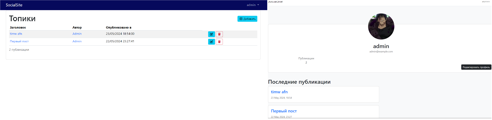

# Laravel Website for posting topics and discussing them

## Laravel Blogging Platform

A feature-rich blogging application built with Laravel 10, providing both web and API interfaces for managing posts and users with modern tooling and best practices.

<i>The project is created for educational purposes, which was taken from an order I made. It is intended for posting articles and discussing them.</i>

---

## Table of Contents

- [Overview](#overview)
- [Features](#features)
- [Developer Experience](#developer-experience)
- [Technology Stack](#technology-stack)
- [Screenshots](#screenshots)
- [Installation](#installation)
- [Before starting](#before-starting)

---

## Overview

This project is a full-stack blogging platform offering:

- **Web Interface**: Traditional Laravel Blade views for browsing, creating, editing, and deleting posts and managing user profiles.
- **API Endpoints**: Versioned RESTful endpoints (v1) secured with Laravel Sanctum, supporting CRUD operations on posts, users, and media uploads.
- **Real-time Broadcasting**: Live updates on post interactions via Laravel Echo channels.
- **Authentication & Authorization**: Powered by Laravel Breeze, Sanctum, email verification, and password reset flows.

---

## Features

- **Media Management**: Upload, store, and delete media using Spatie Laravel Medialibrary.
- **Database Migrations & Schema**: Managed with Eloquent ORM for safe column modifications.
- **Hotwire Turbo Integration**: Enhanced UX with `hotwired-laravel/turbo-laravel` for partial page updates.
- **Admin Panel**: CRUD interfaces for posts and limited user management.
- **Settings & Account Management**: User settings group for updating account info and passwords.
- **Broadcast Channels**: Secure channels for real-time features.
- **Telescope & Debugging**: In-depth profiling and logging with Laravel Telescope and Whoops error handling.

---

## Developer Experience

- Architected RESTful APIs with Laravel Resource Controllers and Sanctum for token-based authentication.
- Implemented web and API routes, leveraging middleware groups (`auth`, `verified`) for secure access control.
- Utilized Hotwire Turbo for seamless, reactive interfaces without excessive JavaScript.
- Configured Laravel Telescope for real-time monitoring and debugging in development.
- Employed PHPUnit and Faker for unit and feature tests to maintain code quality.
- Collaborated in Git-driven workflows, with code style enforcement via Laravel Pint.
- Managed environment configuration and migrations for Eloquent-driven schema changes.

---

## Technology Stack

laravel 10

- [Authentication](https://laravel.com/docs/10.x/authentication)
- API
  - [Sanctum](https://laravel.com/docs/10.x/sanctum)
  - [API Resources](https://laravel.com/docs/10.x/eloquent-resources)
  - Versioning
- [Blade](https://laravel.com/docs/10.x/blade)
- [Email Verification](https://laravel.com/docs/10.x/verification)
- [Filesystem](https://laravel.com/docs/10.x/filesystem)
- [Localization](https://laravel.com/docs/10.x/localization)
- [Mail](https://laravel.com/docs/10.x/mail)
- [Migrations](https://laravel.com/docs/10.x/migrations)
- [Providers](https://laravel.com/docs/10.x/providers)
- [Requests](https://laravel.com/docs/10.x/validation#form-request-validation)
- [Seeding & Factories](https://laravel.com/docs/10.x/seeding)
- [Testing](https://laravel.com/docs/10.x/testing)

Other technologies used in the project were:

- [Bootstrap 5.x](https://getbootstrap.com/)
- [Pint](https://github.com/laravel/pint)
- [Font Awesome](https://fontawesome.com/)
- [spatie/laravel-medialibrary](https://github.com/spatie/laravel-medialibrary)
- [hotwired-laravel/turbo-laravel](https://github.com/hotwired-laravel/turbo-laravel)

---

## Screenshots



---

## Installation

Setting up your development environment on your local machine:
```bash
$ git clone https://github.com/guillaumebriday/laravel-blog.git
$ cd laravel-blog
$ cp .env.example .env
$ php artisan key:generate
$ php artisan horizon:install
$ php artisan telescope:install
$ php artisan storage:link
```

### Mailer

Used [Mailpit](https://github.com/axllent/mailpit) to test emails in development.

---

## Before starting
Need to run the migrations with the seeds :
```bash
$ php artisan migrate --seed
```

This will create a new user that you can use to sign in :
```yml
email: admin@example.ru
password: adminpass
```

And then, compile the assets :
```bash
$ yarn dev 
```

Running tests :
```bash
$ php artisan test
```

Running Laravel Pint :
```bash
$ ./vendor/bin/pint --verbose --test
```

In development environment, rebuild the database :
```bash
$ php artisan migrate:fresh --seed
```